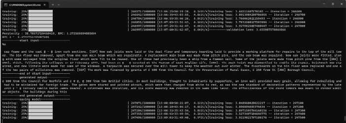
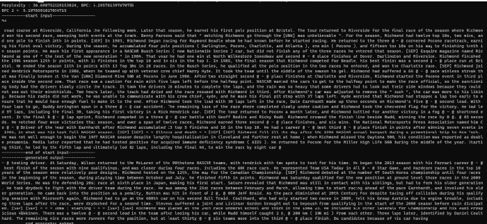

# TransformerWorldLevelModeling_WK103
Transformer Implementation and Perplexity Test on Wikitext-103 for Word Level Language Modeling
In this project, I built on previous work where we implemented a character-level transformer model. In a character-level model, the output layer (logits) has a fixed size of 256, representing all possible characters. However, in a word-level language model, the output size of the logits layer depends on the dictionary size, which contains the unique words from the dataset.

For the Wikitext-103 dataset, the number of unique words is 267,735. Given an embedding size of 512, this would require a weight matrix of 512 x 267,735, resulting in a very large model. To address this, I applied Byte Pair Encoding (BPE), a popular technique that merges infrequent word pieces into single tokens, thereby reducing the dictionary size. This approach is used in models like Transformer-XL, where BPE reduces the number of parameters while still achieving good perplexity scores.

In Transformer-XL, the dictionary size was reduced to around 42,000 through BPE and the adaptive softmax technique, which groups infrequent tokens into clusters to minimize the number of parameters needed for the output layer. By utilizing these techniques, I aimed to achieve a balance between model size and performance.

To further optimize the model, I used the Hugging Face transformers library, which provides many pre-trained transformer models and tokenizers. Specifically, I used the pre-trained BERT tokenizer to convert the input text into tokens. This tokenizer, by design, reduces the dictionary size to 28,996, making the model more efficient while still handling the large-scale Wikitext-103 dataset.

Through the use of BPE, adaptive softmax, and the BERT tokenizer, I was able to keep the model size manageable while maintaining a high level of performance. This combination allowed me to effectively train and evaluate the model using the Wikitext-103 benchmark.

